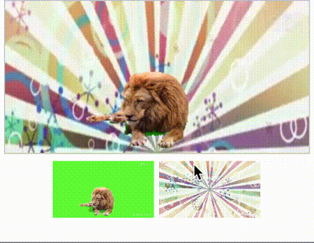

### video assembly 视频背景替换  web前端技术方案

先看下效果



##### 整体思路

- 首先找两个视频素材
- 利用canvas分别获取每个视频的Imagedata
- 根据情况过滤视频的 rgba通道，显示成背景视频；
- 最后渲染到canvas上 

性能提升的关键，这里功能是遍历imagedata（store）的数值进行遍历赋值；
主要是利用的webassembly的性能。

```typescript

export function invertSelf (byteSize: i32, r2:i32,g2:i32,b2:i32):i32 {
  let hf = byteSize/2;
  for (let i = 0; i < hf; i += 4) {
    let pos = i;
    if(Compared(load<u8>(i + 0), load<u8>(i + 1), load<u8>(i + 2), r2,g2,b2)) {
      store<u8>(pos + 0, load<u8>(i + hf + 0));
      store<u8>(pos + 1, load<u8>(i + hf  + 1));
      store<u8>(pos + 2, load<u8>(i + hf  + 2));
    } else {
      store<u8>(pos + 0, load<u8>(i + 0));
      store<u8>(pos + 1, load<u8>(i + 1));
      store<u8>(pos + 2, load<u8>(i + 2));
    }
  }
  return 0;
}

```